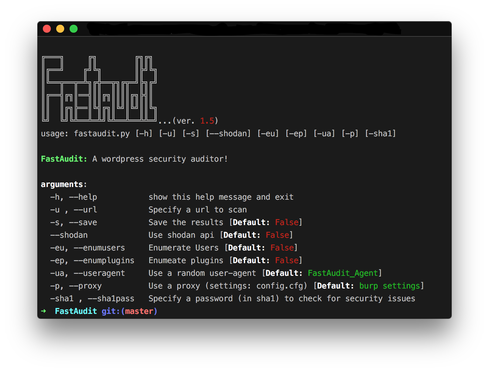
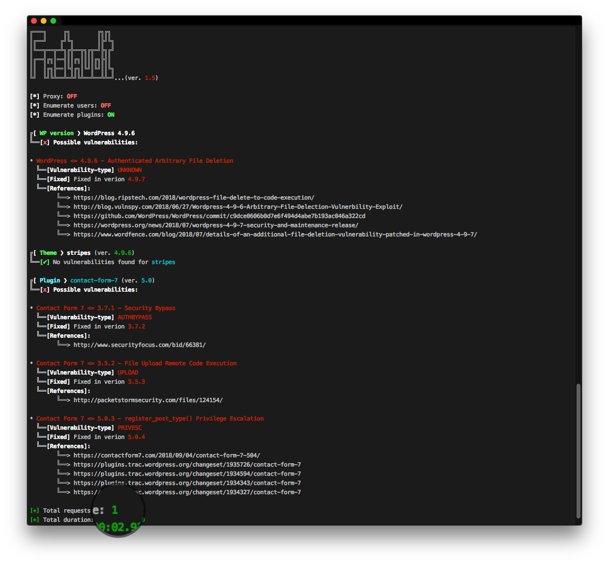

###### A simple and minimal wordpress security auditor!   Audit your wordpress application for security issues with even 1 request.
  
* * *

`FastAudit` is a simple [wordpress](https://wordpress.com/) enumeration tool and security auditor, able to detect possible security issues with even __one__ web-request.

It is inspired by the amazing [WPScan](https://github.com/wpscanteam/wpscan) tool and is of course powered by the [WPScan Vulnerability Database](https://wpvulndb.com/api) to identify possible _plugin/theme/wpVersion_-related vulnerabilities. It performs basic enumeration based on classic techniques and It's nice to use for a fast scan to enumerate the basics. What is special about this tool is that in order to identify possible vulnerabilities (_using -ep option_), it makes _only_ __one__ web-request to the application, so it doesn't slow it down in any way and doesn't mess with its functionality.

This tool is **only** for _enumeration_ and **not** for _exploitation_ - so it doesn't perform any kind of brute-force attack or any other attack in general. This tool can be used by developers and security engineers to scan their wordpress applications for possible vulberabilities (e.g. old plugins etc...) and fix them as soon as possible - that's all!

---

### Features
*   enumerates wp-_version/theme/users/plugins_
*   based on the aboved results uses **WPScan Vulnerability Database** to search for potential vulnerabilities
*   utilizes [shodan-API](https://www.shodan.io/) to search for additional vulnerabilities (_shodan account required for this feature_, may also give false positives sometimes)
*   utilizes [haveibeenpwned](https://haveibeenpwned.com/) service to search if a password (_in sha1_) has been used/breached before (_useful for developers to test their passwords_).

### Requirements:

*   [`tabulate`](https://pypi.python.org/pypi/tabulate)
*   [`colorama`](https://pypi.python.org/pypi/colorama)
*   [`validators`](https://pypi.python.org/pypi/validators/)
*   [`fake_useragent`](https://pypi.python.org/pypi/fake-useragent)

**Note:** To install the requirements:

`pip install -r requirements.txt --upgrade --user`

### Notes
For the _shodan_ and/or _proxy_ to work, you have to set the appropriate values on _config.cfg_. Also even if `--useragent` options is provided, requests to [haveibeenpwned](https://haveibeenpwned.com/) service will be made using `FastAudit_Agent` as user-agent.

### TODO
- [ ] integrate [zoomeye](https://www.zoomeye.org) search also

### Contributions & Feedback

Feedback and contributions are welcome. If you find any bug or have a feature request feel free to open an issue, and as soon as I review it I'll try to fix it!

### Disclaimer
>This tool is only for testing and academic purposes and can only be used where strict consent has been given. Do not use it for illegal purposes! It is the end user’s responsibility to obey all applicable local, state and federal laws. Developers assume no liability and are not responsible for any misuse or damage caused by this tool and software in general.

### Credits
*   Special thanks to [WPScan team](https://github.com/wpscanteam)!
*   Logo designed with [fontmeme.com](https://fontmeme.com/graffiti-fonts/)!

## References
*   https://winningwp.com/how-to-tell-which-plugins-a-website-uses/
*   https://codeable.io/find-out-what-theme-plugins-wordpress/
*   https://stackoverflow.com/questions/1390255/how-do-i-find-out-what-version-of-wordpress-is-running/1390292#1390292

## License

This project is licensed under the GPLv3 License - see the [LICENSE](LICENSE) file for details