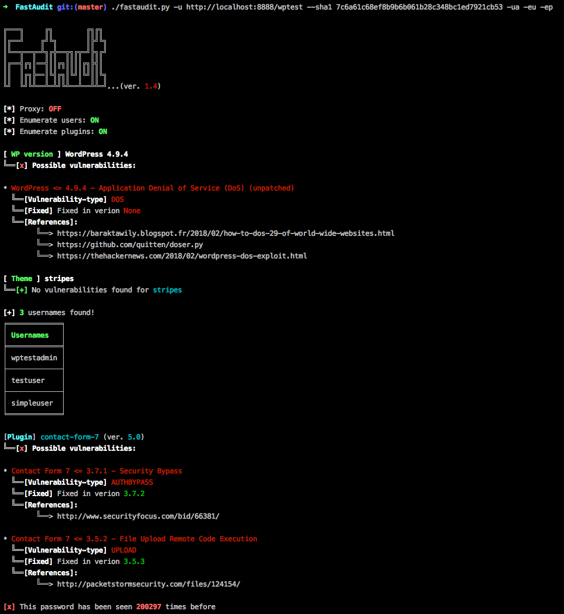

# FastAudit [](https://github.com/chrispetrou/FastAudit/blob/master/LICENSE)

`FastAudit` is a simple [wordpress](https://wordpress.com/) enumeration tool and security auditor.

```
usage: fastaudit.py [-h] [-u] [-eu] [-ep] [-ua] [-p] [-s] [--shodan] [--sha1]

FastAudit: A wordpress security auditor!

arguments:
  -h, --help          show this help message and exit
  -u , --url          Specify a url to scan
  -eu, --enumusers    Enumerate Users [Default: False]
  -ep, --enumplugins  Enumeate plugins [Default: False]
  -ua, --useragent    Use a random user-agent [Default: FastAudit_Agent]
  -p, --proxy         Use a proxy (settings: config.cfg) [Default: burp settings]
  -s, --save          Save the results [Default: False]
  --shodan            Use shodan api [Default: False]
  --sha1              Specify a password (in sha1) to check for security issues
```

It is inspired by the amazing [WPScan](https://github.com/wpscanteam/wpscan) tool and is of course powered by the [WPScan Vulnerability Database](https://wpvulndb.com/api) to identify possible plugin/theme/wpVersion-related vulnerabilities. It performs only very basic enumeration based on old techniques like `?authorid`, `wp-content/plugins` etc..., though I like to use it for a fast scan to enumerate the basics.

This tool is **only** for _enumeration_ and **not** for _exploitation_ - so it doesn't perform any kind of brute-force attack or any other attack in general. This tool can be used by developers and security engineers to scan their wordpress applications for possible vulberabilities (e.g. old plugins etc...) and fix them as soon as possible - that's all!

---



### Features
*   enumerates wp-_version/theme/users/plugins_ (_using basic techniques - check references_)
*   based on the aboved results uses **WPScan Vulnerability Database** to search for potential vulnerabilities
*   utilizes [shodan-API](https://www.shodan.io/) to search for additional vulnerabilities (_shodan account required for this feature_, may also give false positives sometimes)
*   utilizes [haveibeenpwned](https://haveibeenpwned.com/) service to search if a password (_in sha1_) has been used/breached before (_useful for developers to test their passwords_).

### Requirements:

*   [`tabulate`](https://pypi.python.org/pypi/tabulate)
*   [`colorama`](https://pypi.python.org/pypi/colorama)
*   [`validators`](https://pypi.python.org/pypi/validators/)
*   [`fake_useragent`](https://pypi.python.org/pypi/fake-useragent)

**Note:** To install the requirements:

`pip install -r requirements.txt --upgrade --user`

### Notes
For the _shodan_ and/or _proxy_ to work, you have to set the appropriate values on _config.cfg_. Also even if `--useragent` options is provided, requests to [haveibeenpwned](https://haveibeenpwned.com/) service will be made using `FastAudit_Agent` as user-agent.

### Disclaimer
>This tool is only for testing and academic purposes and can only be used where strict consent has been given. Do not use it for illegal purposes! It is the end user’s responsibility to obey all applicable local, state and federal laws. Developers assume no liability and are not responsible for any misuse or damage caused by this tool and software in general.

### TODO
- [ ] integrate [zoomeye](https://www.zoomeye.org) search also
- [ ] detect exact plugin-version when possible

### Credits
Special thanks to [WPScan team](https://github.com/wpscanteam)!

## References
*   https://winningwp.com/how-to-tell-which-plugins-a-website-uses/
*   https://codeable.io/find-out-what-theme-plugins-wordpress/
*   https://stackoverflow.com/questions/1390255/how-do-i-find-out-what-version-of-wordpress-is-running/1390292#1390292

## License

This project is licensed under the GPLv3 License - see the [LICENSE](LICENSE) file for details